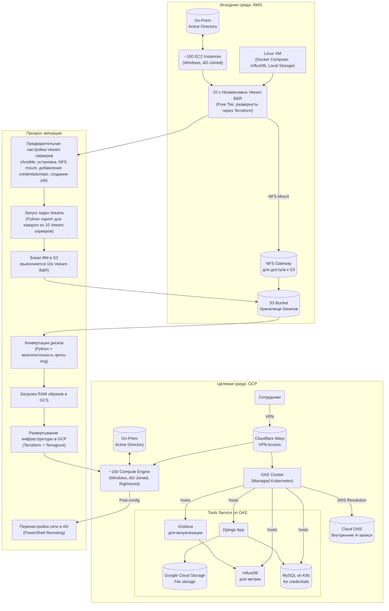

### **Проект: Миграция и модернизация инфраструктуры из AWS в GCP**

**Роль в проекте:** Техлид по инфраструктуре (Infrastructure Tech Lead)

**Краткое описание:** Я руководил комплексным проектом по миграции корпоративной инфраструктуры (~100 Windows-серверов, интегрированных с on-prem Active Directory) из AWS в Google Cloud. Проект выполнялся в условиях жестких ограничений: отсутствие бюджета на специализированные инструменты миграции (например, полная лицензия Veeam), требование минимального даунтайма и отсутствие на тот момент готовых решений для прямой миграции AWS-to-GCP.

Помимо "lift-and-shift" миграции, я инициировал и реализовал модернизацию внутреннего инструментария команды: перевел сервисы с нестабильной Docker Compose на виртуальной машине на управляемый кластер Kubernetes (GKE). Это включало рефакторинг хранения данных, внедрение CI/CD и повышение общей безопасности и доступности сервисов.

**Ключевые достижения:**
* **Стоимость:** Существенно сокращены расходы за счет автоматического подбора оптимальных размеров ВМ (rightsizing), что позволило избежать избыточных трат на CPU и RAM.
* **Надежность:** Внедрен подход Infrastructure as Code (Terraform + Terragrunt), что сделало инфраструктуру полностью воспроизводимой, документированной и легко проходимой для аудитов безопасности.
* **Модернизация:** Устаревшая система на Docker Compose была успешно переведена на GKE, что повысило стабильность, масштабируемость и безопасность внутренних сервисов.
* **Безопасность:** Полностью устранены публичные IP-адреса для ВМ и сервисов за счет внедрения VPN-решения (Cloudflare Warp), что кардинально повысило уровень безопасности.

---
### Proof of Concept

Так как работающий из коробки GCP инструмент для миграции из AWS в GCP не существовал в 2021 году, я начал проект 
с определения жизнеспособности и эффективности разных существующих подходов.
На тот момент, существовало несколько готовых утилит для миграции, но они либо не вписывались в бюджет, либо не 
обеспечивали нужного уровня контроля.
Я так же работал с командой контракторов, которые предложили эту работу выполнить под ключ, но бюджет запрашиваемый 
был в два раза больше выделенного.
Я решил стояющую передо мной задачу самоятоятельно, и вспомнил про Veeam, который я поддерживал как технический суппорт 
на протяжении нескольких лет.

Чтобы убедиться в жизнеспособности выбранного подхода к бэкапу без бюджета и минимизировать риски, я провел детальный
этап Proof of Concept (PoC). Этот процесс не только подтвердил техническую реализуемость, но и стал основой для 
дальнейшей автоматизации и документирования.

**Исследование API с помощью Postman:** Я начал с установки одного Veeam-сервера в AWS. Вместо того чтобы сразу 
писать код, я использовал Postman для интерактивного исследования Veeam API. Это позволило мне в безопасной среде 
"прощупать" эндпоинты, понять структуру аутентификации, сформировать правильные тела запросов для запуска задач 
и отслеживания их статуса. Такой подход сэкономил время и помог быстро выявить все нюансы работы API.

**От GUI к CLI — генерация curl запросов:** После того как я добился стабильного выполнения всех необходимых операций
в Postman (старт бэкапа, проверка статуса), я воспользовался встроенной функцией для экспорта каждого успешного 
запроса в формат curl. Это дало мне немедленный, работающий из командной строки прототип. Эти curl-команды стали 
первым слоем исполняемой документации — их можно было запустить, проверить и передать другим инженерам для валидации.

**Автоматизация и масштабирование с Python:** Имея на руках рабочие curl-команды, я перешел к созданию масштабируемого
решения. Я обернул логику этих запросов в Python-скрипт, используя библиотеку requests. Это позволило добавить 
обработку ошибок, логирование, а также возможность динамически передавать параметры (например, ID виртуальных машин), 
что было критически важно для дальнейшего масштабирования на всю инфраструктуру из ~100 машин.
Понимая, что я действую в роли техлида, я уделил особое внимание коммуникации и документированию. Я создал страницу 
в Confluence, где подробно описал весь процесс PoC:

- Цели: Четко сформулировал, что мы пытаемся проверить.
- Инструменты: Описал, почему были выбраны Postman, curl и Python.
- Пошаговая инструкция: Включил скриншоты из Postman, примеры curl-команд и финальный Python-скрипт с комментариями.
- Выводы: Зафиксировал, что PoC прошел успешно и решение готово к масштабированию.

Такой подход позволил сделать процесс прозрачным для всей команды и менеджмента. Любой инженер мог воспроизвести 
мои шаги, а готовая документация значительно упростила передачу знаний и снизила риски, связанные с зависимостью от
одного специалиста. Это продемонстрировало мою приверженность не только техническому результату, но и созданию 
устойчивых и понятных систем.

---

### **Архитектура миграции**

Ниже представлена общая схема, описывающая исходное состояние в AWS, процесс миграции и целевую архитектуру в GCP.



---

### **Примеры конфигов и скрипты**

#### **1. Автоматизация бэкапов (Python + Veeam API)**
Скрипт для удаленного запуска задач бекапа через API Veeam.

- [veeam_backup_trigger.py](./veeam_backup_trigger.py)

Python-скрипт, предназначен для программного запуска задач бекапа Veeam через RESTful API 
Veeam Backup & Replication. Такая автоматизация облегчает резервное копирование по требованию, 
интегрируется с пайплайнами CI/CD или служит компонентом в более крупных процессах оркестрации
бекапа.

#### **2. Rightsizing (питон-скрипт для анализа метрик)**
Скрипт для анализа CSV-экспорта из AWS CloudWatch и подбора оптимального типа машины в GCP.

- [rightsizing_analyzer.py](./rightsizing_analyzer.py) 

Скрипт используется для этапа планирования облачной миграции — оптимизации размеров
(_rightsizing_) существующих рабочих нагрузок. Он автоматизирует процесс анализа
метрик использования ресурсов из AWS CloudWatch для подбора наиболее экономически эффективных
и производительных типов машин в GCP.

#### **3. IaC: Развертывание Veeam сервера (Terraform + Ansible)**

Этот раздел демонстрирует подход IaC для автоматизированного развертывания и начальной 
настройки серверов Veeam Backup & Replication в AWS. Используется комбинация Terraform для 
выделения инфраструктуры и Ansible для конфигурации программного обеспечения.

Архитектура бэекапа спроектирована с учетом масштабирования и параллелизма. Для обеспечения
эффективного бэкапа ~100 виртуальных машин, развернуто 10 независимых серверов Veeam Backup
& Replication. Каждый такой сервер отвечает за резервное копирование своей группы из ~10
виртуальных машин, что позволяет выполнять множество операций бэкапа конкурентно, значительно
сокращая общее окно резервного копирования. Такой подход демонстрирует применение концепций
распределенного параллелизма для оптимизации производительности.

**Terraform (`aws/veeam_server.tf`):**

- [aws/veeam_server.tf](./aws/veeam_server.tf) 

**Ansible (`ansible/install_veeam.yml`):**

- [aws/install_veeam.yml](./aws/install_veeam.yml) 

#### **4. Конвертация дисков (Python + мультипроцессинг qemu-img)**
Шаг конвертации дисковых образов (.vmdk в .raw) является потенциальным узким местом, особенно
при большом количестве машин. Для сокращения времени конвертации и, как следствие, уменьшения
downtime, реализована параллельная обработка образов.
После завершения резервного копирования на каждом из 10 серверов Veeam, запускается Python
скрипт, который оркеструет процесс конвертации. Скрипт использует многопоточность (например,
с помощью библиотеки multiprocessing) для одновременного запуска нескольких процессов qemu-img
convert. Это позволяет эффективно использовать ресурсы машины и значительно ускорить 
конвертацию всех образов по сравнению с последовательной обработкой.

- [aws/convert_disks.py](./aws/convert_disks.py) 

**Преимущества параллельной конвертации:**

- **Сокращение времени миграции:** Параллельная обработка значительно уменьшает общее время, необходимое для конвертации всех дисков.
- **Эффективное использование ресурсов:** Многопоточность позволяет полностью использовать доступные ресурсы CPU и дисковой подсистемы.
- Дальнейшие улучшения могут включать динамическое масштабирование количества потоков в зависимости от доступных ресурсов и приоритезацию конвертации критически важных виртуальных машин.

#### **5. IaC: Иерархическая структура в GCP (Terragrunt + Terraform)**

**Структура папок:**

- [gcp/](gcp)

**Корневой `terragrunt.hcl`:**

- [gcp/terragrunt.hcl](gcp/terragrunt.hcl)

**`terragrunt.hcl` для модуля сети (`02-network/`):**

- [gcp/02-network/terragrunt.hcl](gcp/02-network/terragrunt.hcl)

**`terragrunt.hcl` для модуля storage (`03-storage/`):**

- [gcp/03-storage/terragrunt.hcl](gcp/03-storage/terragrunt.hcl)

**`terragrunt.hcl` для модуля compute (`04-compute/`):**

- [gcp/04-compute/terragrunt.hcl](gcp/04-compute/terragrunt.hcl)

**Использование remote state в `04-compute/data.tf` и сам `04-compute/main.tf`:**

- [gcp/04-compute/data.tf](gcp/04-compute/data.tf)
- [gcp/04-compute/main.tf](gcp/04-compute/main.tf)

---

#### **5. Модернизация на GKE (Kubernetes Manifests)**

Развертываем основные компоненты приложения Django, а также вспомогательные сервисы баз данных
(MySQL) и системы мониторинга (InfluxDB и Grafana) в Google Kubernetes Engine с использованием 
декларативных манифестов Kubernetes. Файлы структурированы по логическим доменам для улучшения
читаемости, управляемости и соответствия принципам Infrastructure as Code.

##### **A. Структура директорий Kubernetes манифестов**

Все манифесты Kubernetes расположены в директории `k8s/` и разделены по компонентам:

```
k8s/
├── django-app/      # Манифесты для Django-приложения
│   ├── django-deployment.yaml
│   ├── django-secrets.yaml
│   └── django-service.yaml
├── monitoring/      # Манифесты для InfluxDB и Grafana
│   ├── influxdb-deployment.yaml
│   ├── influxdb-pvc.yaml
│   ├── influxdb-secrets.yaml
│   ├── influxdb-service.yaml
│   ├── grafana-configmap.yaml
│   ├── grafana-deployment.yaml
│   ├── grafana-pvc.yaml
│   ├── grafana-secrets.yaml
│   └── grafana-service.yaml
└── mysql/           # Манифесты для MySQL базы данных
    ├── mysql-deployment.yaml
    ├── mysql-pvc.yaml
    ├── mysql-secrets.yaml
    └── mysql-service.yaml
```

---

##### **B. Компоненты**

1.  **Django-приложение (`k8s/django-app/`)**
    * **`django-deployment.yaml`**: Определяет Kubernetes Deployment для основного Django-приложения. Он обеспечивает запуск 2 реплик контейнера `tools-app:v1` (образ из Google Container Registry), прослушивающего порт 8000. Настройки окружения включают хост базы данных (`mysql-service.default.svc.cluster.local` для внутреннего DNS-разрешения), имя бакета GCS для загрузок и секретный ключ Django, безопасно извлекаемый из секрета Kubernetes.
    * **`django-service.yaml`**: Объявляет Kubernetes Service типа `LoadBalancer` для Django-приложения. Это обеспечивает внешний доступ к приложению через внешний IP-адрес, управляемый балансировщиком нагрузки GCP. Сервис перенаправляет трафик с порта 80 на порт 8000 контейнеров Django.
    * **`django-secrets.yaml`**: Содержит секреты, такие как `DJANGO_SECRET_KEY`, в формате Kubernetes Secret. Значения закодированы в Base64.

2.  **MySQL База данных (`k8s/mysql/`)**
    * **`mysql-deployment.yaml`**: Определяет Deployment для контейнера MySQL версии 8.0. Пароль root пользователя извлекается из Kubernetes Secret. База данных использует `PersistentVolumeClaim` для обеспечения постоянства данных.
    * **`mysql-service.yaml`**: Kubernetes Service для MySQL, обеспечивающий доступ к базе данных внутри кластера через внутренний DNS (`mysql-service.default.svc.cluster.local`), используемый Django-приложением.
    * **`mysql-pvc.yaml`**: `PersistentVolumeClaim` для динамического выделения постоянного хранилища объемом 10GiB для данных MySQL. Это гарантирует сохранность данных базы данных при перезапуске или перемещении подов.
    * **`mysql-secrets.yaml`**: Хранит учетные данные MySQL, такие как `MYSQL_ROOT_PASSWORD`, в виде Kubernetes Secret. Значения должны быть закодированы в Base64.

3.  **Мониторинг (InfluxDB и Grafana) (`k8s/monitoring/`)**
    * **InfluxDB:**
        * **`influxdb-deployment.yaml`**: Развертывает экземпляр InfluxDB 1.8. Настроена аутентификация и создание базы данных по умолчанию, используя секреты для учетных данных администратора и имени БД. Данные InfluxDB также хранятся на постоянном томе.
        * **`influxdb-service.yaml`**: Kubernetes Service типа `ClusterIP` для InfluxDB, делая его доступным только внутри кластера на порту 8086.
        * **`influxdb-pvc.yaml`**: `PersistentVolumeClaim` для InfluxDB, запрашивающий 10GiB постоянного хранилища.
        * **`influxdb-secrets.yaml`**: Содержит учетные данные для InfluxDB (пользователь, пароль, имя БД), закодированные в Base64.
    * **Grafana:**
        * **`grafana-deployment.yaml`**: Развертывает экземпляр Grafana версии 10.4.0. Учетные данные администратора Grafana извлекаются из секрета. Grafana настроена на автоматическую инициализацию источников данных через ConfigMap. Для постоянства данных дашбордов и конфигурации используется PVC.
        * **`grafana-service.yaml`**: Kubernetes Service для Grafana. В примере указан `LoadBalancer`, что делает Grafana доступной извне кластера по публичному IP-адресу. При необходимости его можно изменить на `ClusterIP` для внутреннего доступа или использовать Ingress для более сложных правил маршрутизации.
        * **`grafana-pvc.yaml`**: `PersistentVolumeClaim` для Grafana, запрашивающий 1GiB хранилища для своих данных.
        * **`grafana-secrets.yaml`**: Хранит учетные данные администратора Grafana в виде Kubernetes Secret.
        * **`grafana-configmap.yaml`**: Содержит конфигурацию источника данных Grafana, автоматически настраивая InfluxDB как источник данных, используя внутренний DNS `influxdb-service:8086`. *Примечание: В производственной среде пароль для источника данных InfluxDB должен быть безопасно передан через Kubernetes Secret, а не непосредственно в ConfigMap.*

---

#### **6. Автоматизация переподключения к домену (PowerShell Remoting)**

- [re-join_domain.ps1](./re-join_domain.ps1)

#### **7. CI/CD: Сборка и публикация образа в GCR (GitHub Actions)**
Для автоматизации сборки и отправки Docker-образа Django-приложения в Google Container Registry при каждом коммите в основную ветку, я настроил следующий workflow для GitHub Actions. Этот подход устраняет ручные шаги и обеспечивает консистентность сборок.

- [.github/workflows/build-and-push-to-gcr.yml](github/workflows/build-and-push-to-gcr.yml)

##### **Объяснение и необходимые условия для работы этого workflow:**

1.  **Триггеры (`on`):** Workflow запускается автоматически при любом изменении в ветке `main` и также может быть запущен вручную.
2.  **Аутентификация (`permissions` и `google-github-actions/auth`):** Вместо хранения JSON-ключа сервисного аккаунта в секретах GitHub, использую **Workload Identity Federation**. Это безопасный метод, при котором GitHub Actions получает временный токен доступа от GCP. Для этого необходимо:
    * В GCP создать Workload Identity Pool и Provider.
    * Создать сервисный аккаунт (Service Account) и выдать ему роль `Storage Admin` (`roles/storage.admin`), чтобы он мог записывать образы в GCR.
    * Связать этот сервисный аккаунт с GitHub-репозиторием через Workload Identity Provider.
    * В секретах репозитория GitHub создать два секрета: `GCP_WIF_PROVIDER` (полный путь к провайдеру) и `GCP_SERVICE_ACCOUNT` (email сервисного аккаунта).
3.  **Логин в GCR (`docker/login-action`):** Этот шаг использует полученный на предыдущем этапе токен для аутентификации Docker-клиента в Google Container Registry.
4.  **Сборка (`docker/build-push-action`):**
    * Этот шаг находит `Dockerfile` в корне репозитория.
    * Собирает Docker-образ.
    * Присваивает ему два тега: `latest` для простоты использования и тег с **SHA коммита** (`${{ github.sha }}`) для точной трассировки и возможности отката на любую конкретную версию кода.
    * Отправляет собранный образ в GCR.
